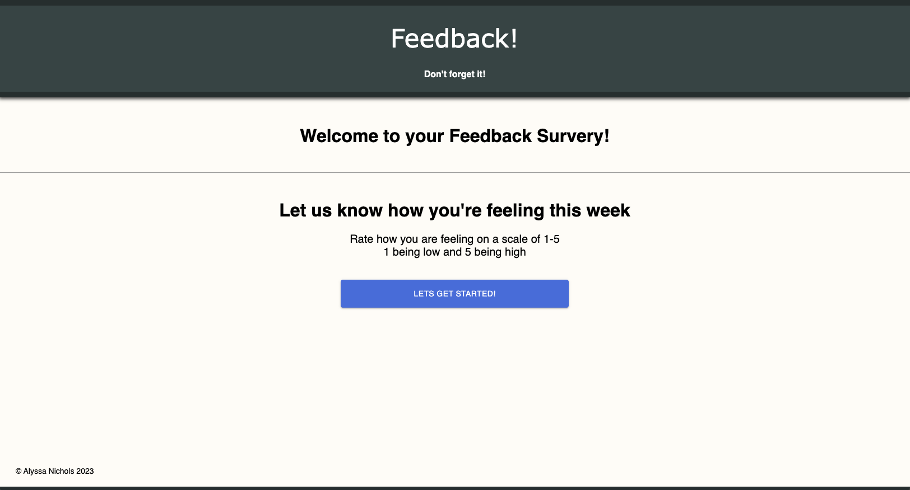
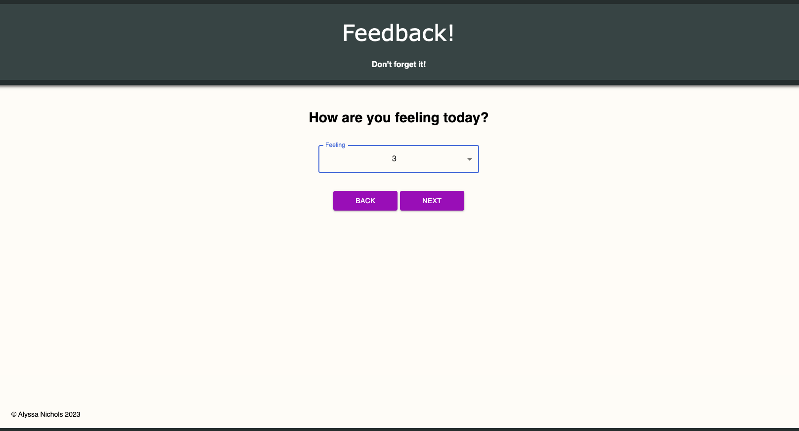
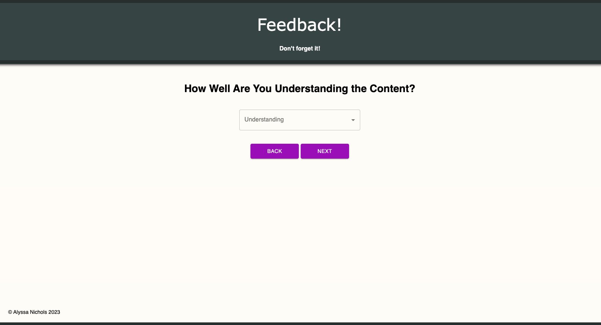
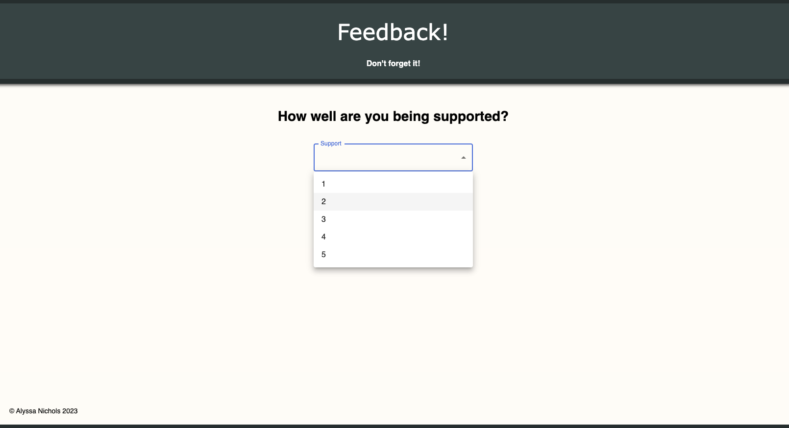
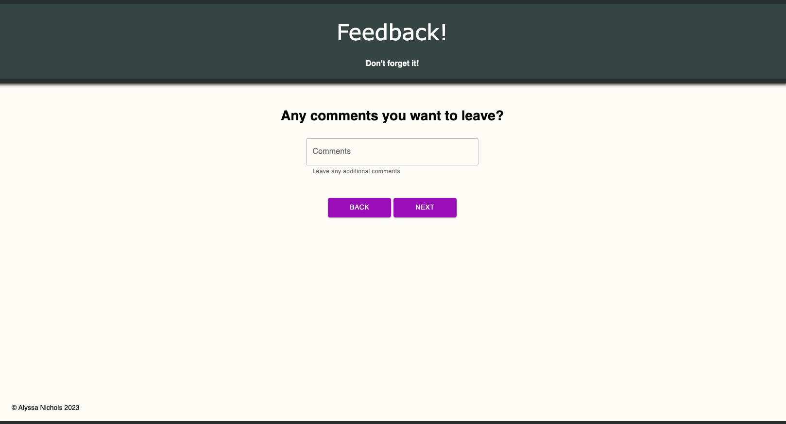
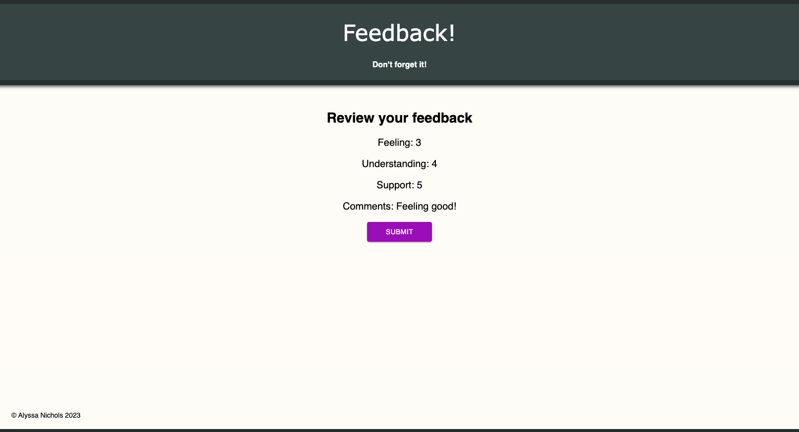
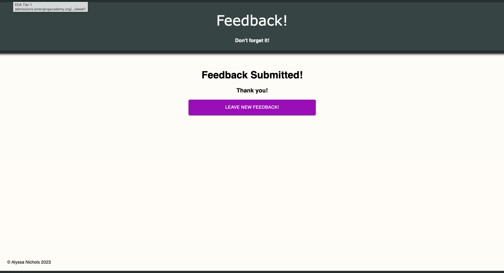
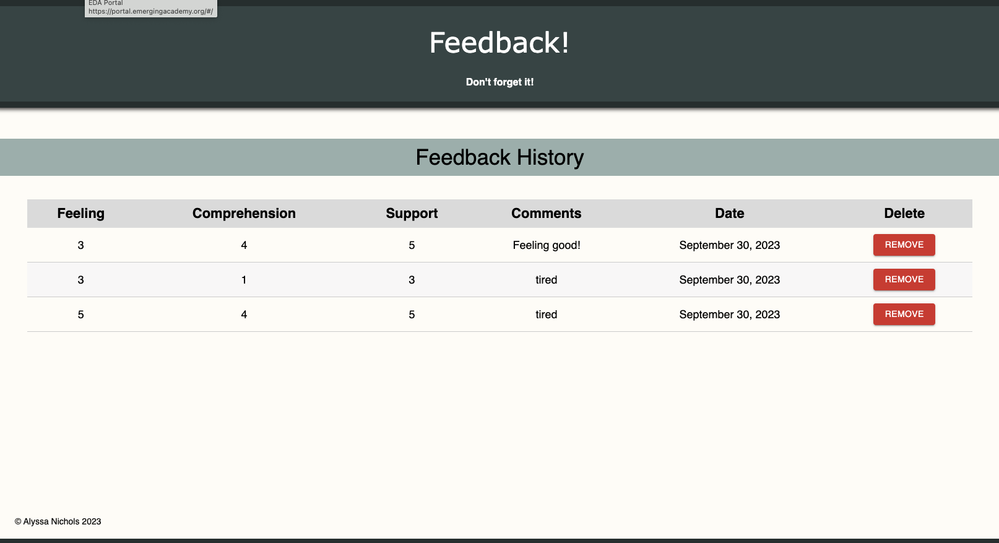

# Feedback Survery

### SETUP

Link to software that is required to install the app (e.g. node).

- [Node.js](https://nodejs.org/en/)
- [PostgreSQL](https://www.postgresql.org)

## Database:
- Please reference the databse.sql file to create a new database 
- [Postico] recommended to setup table (https://eggerapps.at/postico/) 
- Create database called 'prime_feedback' 

## Installation

1. Clone Repository
4. Run 'npm install'
5. Run 'npm run server'
6. Run 'npm run client' - you will need multiple terminals open for this
7. App should open in your browser

Running the server code requires `nodemon`. If you don't already have `nodemon`, install it globally with `npm install nodemon --global`.

### DESCRIPTION

This project is, start to finish, a 8 page web application. 
While there is no nav bar, each part of the form is at its own route. Clicking next should move the user to the appropriate step in the process.
1. This is a feedback form that has a home page that prompts the user to start the survey and on the click of the button is transported to the next page.
2. The second page is a Feelings feedback form that lets the user enter a number 1-5 of how they are feeling today. It will not allow the user to move on if the field is left empty. There is a back button that will take the user back to the homepage and a next button for when they have unputted a feeling rating and it will move them on to the next page.
3. The third page is a Understanding the content feedback page. Same as the page before, it needs input to move on and has a back button that brings them to the previous page to edit their rating there. The next button functions the same and brings them to the next page.
4. The fourth page is a How well are you being supported page and has the same functionality as the prior 2. Needs input, back button to go back to edit, and a next button to move on.
5. The fifth page is a Comments page and prompts the user to leave any additional comments. Comments are NOT required so you can either go back and edit prior scores or hit next and continue the survey.'
6. The sixth page is a Feedback Review page where you can see your results from each section but you cannot change any of the values. There is a submit button that submits the feedback data to the Database.
7. The seventh page is a page that shows that the feedback has been submitted and has a button to start a new feedback survey that will reset all the data and return the user to the homepage. 
8. The 8th page is a hidden page that is meant only for admin personel. It has a table that shows all of the feedback history and has a button that can remove a specific feedback via the button in its own row. It removes the feedback from the table AND the database so there is an alert to make sure they want to go through with the delete.  

## PHOTOS OF THE PAGES
1.
2.
3.
4.
5.
6.
7.
8.

### Built With

 - HTML
 - CSS
 - Axios
 - Javascript
 - React.js
 - Redux
 - Material UI
 - PG
 - Express.js
 - PostgresSQL
 - Postico
 - Postman
 - Git
 - GitHub
 - VScode
 - Nodemon (for development)

### Acknowledgement

Thanks to [Emerging Digital Academy](http://www.emergingacademy.org) who equipped and helped me to make this application a reality. 

### Support

If you have suggestions or issues, please email me at [alyssa.s.nichols94@gmail.com](mailto:alyssa.s.nichols94@gmail.com)
